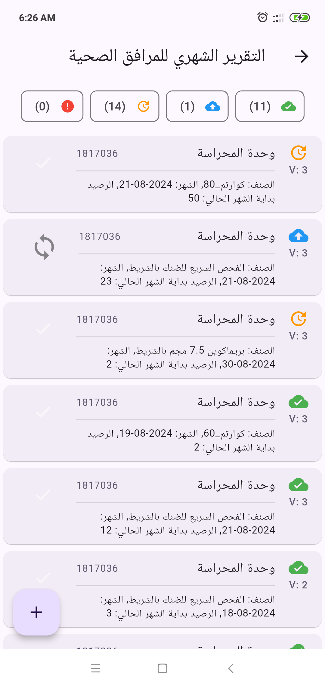
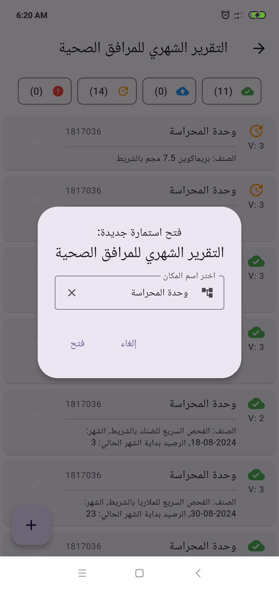

# Data-Run-Mobile

## Overview

Data-Run-Mobile is a Flutter application developed for the National Malaria Control Program (NMCP)
in Yemen. The app facilitates the submission and synchronization of malaria-related data with the
main backend system, Data-run-Api. This tool is designed to streamline data collection processes and
ensure accurate and timely data transmission to support malaria control efforts.

## Features

- **Dynamic Form Download**: The app downloads forms designed on the backend, which can include
  various question types.
- **Question Types**: Supports Text, Number, Date, Multi Answer, Single Answer, Image, and File
  questions.
- **Data Submission**: Users can submit various malaria-related data directly from the app.
- **Data Synchronization**: The app syncs submitted data with the Data-run-Api, ensuring all
  information is up-to-date.
- **User Authentication**: Secure login and authentication to ensure data integrity and privacy.
- **User Management**: Quickly create users and assign them to particular teams.
- **Offline Mode**: Allows data entry even when offline; data will be synced once the internet
  connection is restored.
- **User-Friendly Interface**: Simple and intuitive design to facilitate ease of use by healthcare
  workers.
-

## Screenshots

# Project Name

## Screenshots

|  |  |    |
| ----------------------- | ----------------------- |---------------------------|
|  |  |    |
|  |  |    |
|  |  |  |


## Installation

To install Data-Run-Mobile on your device, follow these steps:

1. **Clone the Repository**:
   ```bash
   git clone https://github.com/Hamza-ye/datarun-mobile.git
   ```
2. **Navigate to the Project Directory**:
   ```bash
   cd data-run-mobile
   ```
3. **Install Dependencies**:
   ```bash
   flutter pub get
   ```
4. **Run the App**:
   ```bash
   flutter run
   ```

## Usage

1. **Login**: Enter your credentials to access the app.
2. **Download Forms**: Navigate to the forms section to download the latest forms from the backend.
3. **Data Entry**: Fill out the forms with the required data. The forms can include various types of
   questions:
    - **Text**: Enter textual information.
    - **Number**: Enter numerical data.
    - **Date**: Select dates from a date picker.
    - **Multi Answer**: Select multiple options from a list.
    - **Single Answer**: Select one option from a list.
    - **Image**: Capture or upload images.
    - **File**: Upload files.
4. **User Management**: Create users and assign them to specific teams.
5. **Sync Data**: Ensure your device is connected to the internet and use the sync feature to upload
   data to the Data-run-Api.
6. **View and Edit Submissions**: Check previous submissions and their sync status.

## Contributing

We welcome contributions to enhance Data-Run-Mobile. Please follow these steps:

1. Fork the repository.
2. Create a new branch (`git checkout -b feature-branch`).
3. Commit your changes (`git commit -m 'Add new feature'`).
4. Push to the branch (`git push origin feature-branch`).
5. Create a pull request.

## License

This project is licensed under the MIT License. See the [LICENSE](LICENSE) file for details.

## Contact

For questions or support, please contact:

- **Project Maintainer**: Hamza
- **Email**: 7amza.it@gmail.com
